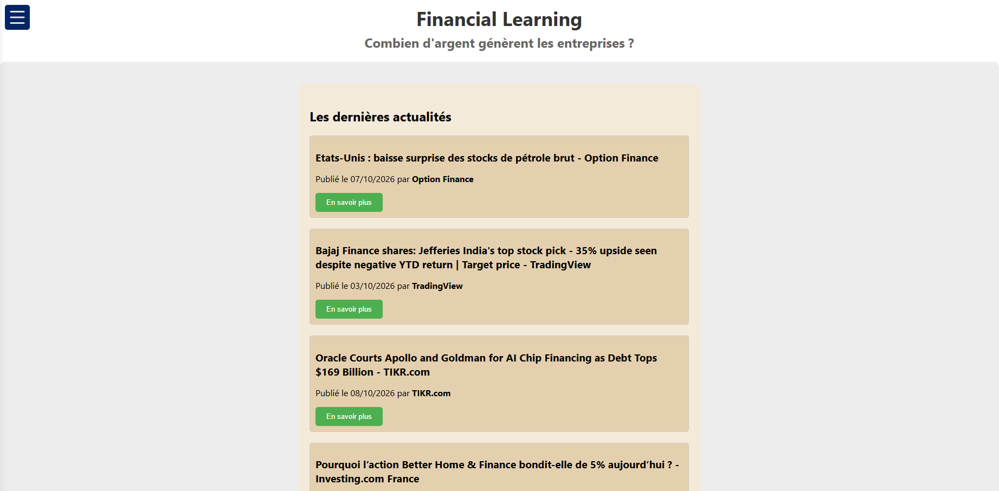
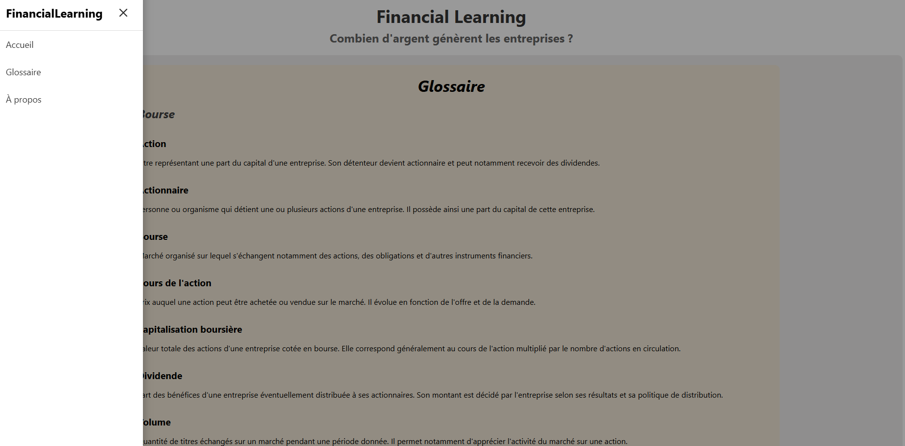
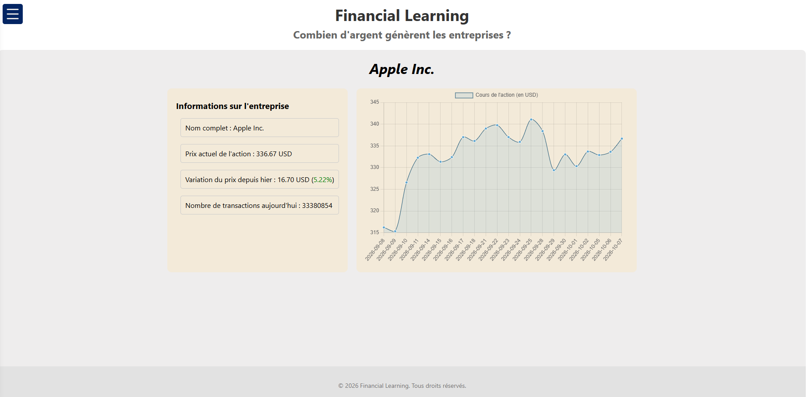

# FinancialLearn

FinancialLearn est un projet consistant à proposer un site web permettant de visualiser des informations liées au monde de la finance.

## Objectifs
L'objectif derrière l'élaboration de ce site est multiple :
- Pour les personnes non experts dans ce domaine, avoir accès à une introduction du monde de la finance, avec des notions comme la bourse, l'investissement et les actions.
- Pour moi, en tant que développeur, me permettre de pratiquer mes compétences en développement web.

## Structure
Le site est décomposé en deux parties :
- Le **FrontEnd**, qui est la partie visible du site, développée en utilisant React couplé à TypeScript.
- Le **BackEnd**, qui est la partie serveur du site, développée avec Node.js et Express. C'est également depuis le back que je fais le traitement des données.

Les données récupérées sont issues de sources financières fiables, comme **Yahoo Finance** et **Google Finance**. Les données d'actualités sont récupérées depuis le flux RSS de Google Finance, tandis que les données des entreprises sont récupérées depuis l'API de Yahoo Finance.

## Aperçu
En tant qu'UX Designer, j'ai voulu proposer une interface claire et épurée, qui ne contient que les éléments strictement nécéssaire.

La navigation se fait via l'utilisation du menu de navigation accessible via le bouton situé en haut à gauche. Cela permet de basculer entre les pages d'accueil, le glossaire et d'à propos.

## Informations complémentaires
- Ce site à été réalisé sur mon temps libre et n'a pas pour but d'être déployé.
- Il m'a fallu environ 7h de développement pour mettre au point ce site.